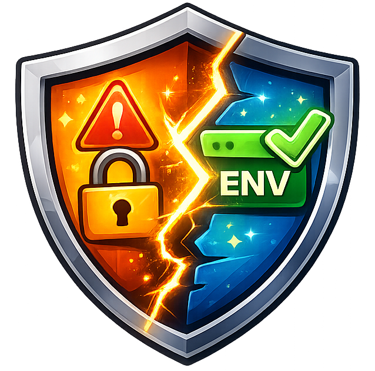
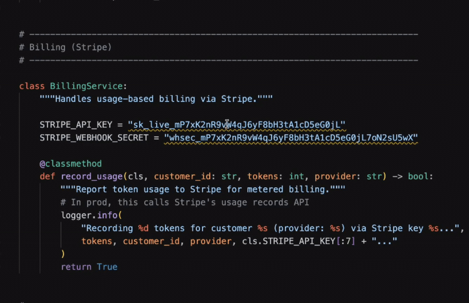

# Envify

**Find and Fix Hardcoded API Keys Automatically**

A VS Code extension that detects exposed secrets and automatically migrates them to environment variables.



---

## 🎬 Demo

### Scan Entire Workspace & Fix All



Envify scans your entire workspace, detects exposed secrets, and fixes them automatically.

---

### Quick Fix in Action


Detect a hardcoded API key, press Quick Fix, and Envify will:

- Replace the secret with an environment variable
- Generate a `.env` file
- Update `.gitignore`
- Keep your code syntax valid

---

## Features

### Secret Detection

Detect hardcoded secrets in real time.

Supported providers:

- OpenAI
- Anthropic
- Groq
- OpenRouter
- DeepSeek
- Gemini

Plus high-entropy secret detection for unknown providers.

---

### One-Click Quick Fix

Convert:

```python
api_key = "sk-proj-xxxxxxxx"
```

into:

```python
import os

api_key = os.getenv("OPENAI_API_KEY")
```

Automatically.

---

### Workspace Scan

Scan your entire project with a single click.

View:

- File path
- Secret type
- Line number
- Suggested environment variable

from a centralized dashboard.

---

### Fix All Secrets

Fix every detected secret across the workspace.

Automatically:

- Generate `.env`
- Update `.gitignore`
- Replace hardcoded values
- Preserve valid syntax

---

### Toolbar Integration

Launch scans directly from the VS Code toolbar.

No command palette required.

---

## Installation

### From VS Code Marketplace

Search for:

```
Envify
```

and click Install.

---

## Usage

### Scan Current File

Open a source file containing secrets.

Envify will automatically highlight detected secrets.

### Quick Fix

Place your cursor on a detected secret.

Press:

```
Cmd + .
```

Choose:

```
Replace with Environment Variable
```

Envify will handle the rest.

### Scan Entire Workspace

Click the Envify toolbar button.

Or run:

```
Envify: Scan Entire Workspace
```

from the command palette.

---

## Supported Languages

- Python
- JavaScript
- TypeScript
- React TSX

More languages coming soon.

---

## Why Envify?

Most secret scanners stop at detection.

Envify goes one step further.

Instead of telling you that a secret exists, it helps you fix the problem automatically.

---

## Roadmap

- [x] Secret Detection
- [x] Quick Fix
- [x] Automatic .env Generation
- [x] Automatic .gitignore Updates
- [x] Workspace Scan
- [x] Fix All Secrets
- [ ] More Providers
- [ ] Git Commit Protection
- [ ] CI/CD Integration

---

## License

MIT License

---

Built originally by Boyuan (Paul) Ning.